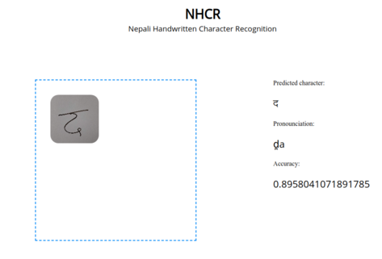

# Nepali Handwritten Character Recognition

NHCR is an implementation of deep convolutional neural network for recognizing handwritten Nepali characters. A web interface is proveded for testing the model with your own input image.



## Installation

Use the package manager [pip](https://pip.pypa.io/en/stable/) to install pipenv and install requirements.

```bash
pip install pipenv
pipenv install --ignore-pipfile 
```

## Usage


```bash
$ export FLASK_APP=app.py
$ flask run
```

## Dataset

The DHCD Dataset used in this application is available [here](https://github.com/Prasanna1991/DHCD_Dataset).

## Bibtex
```
@inproceedings{acharya2015deep,
  title={Deep learning based large scale handwritten Devanagari character recognition},
  author={Acharya, Shailesh and Pant, Ashok Kumar and Gyawali, Prashnna Kumar},
  booktitle={Software, Knowledge, Information Management and Applications (SKIMA), 2015 9th International Conference on},
  pages={1--6},
  year={2015},
  organization={IEEE}
}
```